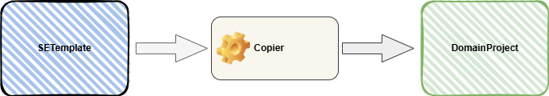
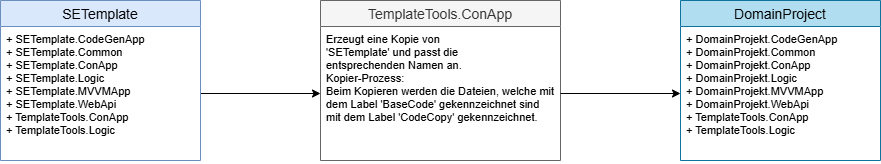

# SETemplate – Vorlage für SE-Architektur-Projekte

**Inhaltsverzeichnis:**

- [SETemplate – Vorlage für SE-Architektur-Projekte](#setemplate--vorlage-für-se-architektur-projekte)
  - [Einleitung](#einleitung)
  - [Projektübersicht](#projektübersicht)
  - [Voraussetzungen](#voraussetzungen)
  - [Arbeitsweise von SETemplate](#arbeitsweise-von-setemplate)
    - [Projekterstellung](#projekterstellung)
  - [Verwendung der Vorlage SETemplate](#verwendung-der-vorlage-setemplate)
    - [Repository klonen](#repository-klonen)
    - [Bedienungsanleitung](#bedienungsanleitung)
      - [Hauptmenü](#hauptmenü)
        - [Menü-Option: Copier](#menü-option-copier)
        - [Menü: Preprocessor](#menüpreprocessor)
        - [Menü: CodeGenerator](#menü-codegenerator)
        - [Menü: Synchronization](#menü-synchronization)
        - [Menü: Cleanup](#menü-cleanup)
  - [Beispiele](#beispiele)
    - [Beispiel 1: SEBookStore](#beispiel-1-sebookstore)
  - [Authentifizierung](#authentifizierung)
    - [Rollenbasiertes Zugriffssytem](#rollenbasiertes-zugriffssytem)
      - [Funktionsweise](#funktionsweise)
        - [PasswordHash und PasswordSalt](#passwordhash-und-passwordsalt)
          - [PasswordHash](#passwordhash)
          - [PasswordSalt](#passwordsalt)
        - [TimeOutInMinutes](#timeoutinminutes)
      - [Anmeldung](#anmeldung)

---

## Einleitung

Das **SETemplate** ist eine wiederverwendbare Projektvorlage, die auf dem Konzept von [SEArchitecture](https://github.com/leoggehrer/SEArchitecture) basiert. Sie dient als technische Grundlage für Anwendungen, die einer strukturierten und wartbaren Software-Architektur folgen sollen und ermöglicht die schnelle und einheitliche Erstellung neuer Projekte.

**Zielgruppe:** Entwickler: innen, die auf Basis der definierten Architektur schnell Projekte **aufsetzen**, **anpassen** und **erweitern** wollen.

---

## Projektübersicht

|Projekt|Beschreibung|Typ|Abhängigkeit|
|---|---|---|---|
|**SETemplate.Common** |In diesem Projekt werden alle Hilfsfunktionen, allgemeine Erweiterungen und Schnittstellen zusammengefasst. Diese sind unabhängig vom Problembereich und können auch in andere Domän-Projekte wiederverwendet werden.| Library | keine |
|**SETemplate.Logic**|Dieses Projekt beinhaltet den vollständigen Datenzugriff, die gesamte Geschäftslogik und stellt somit den zentralen Baustein des Systems dar.| Library | SETemplate.Common |
|**SETemplate.Logic.UnitTest**|In diesem Projekt befinden sich die **Unit-Tests** für die gesamte Geschäftslogik.| MSTest | SETemplate.Logic, SETemplate.Common |
|**SETemplate.WebApi**|In diesem Projekt ist die REST-Schnittstelle implementiert. Dieses Modul stellt eine API (Aplication Programming Interface) für den Zugriff auf das System über das Netzwerk zur Verfügung.| Host | SETemplate.Logic, SETemplate.Common |
|**SETemplate.ConApp**|Dieses Projekt dient als Initial-Anwendung zum Erstellen bzw. Abgleichen der Datenbank, das Anlegen von Konten falls die Authentifizierung aktiv ist und zum Importieren von bestehenden Daten. Nach der Initialisierung wird diese Anwendung kaum verwendet.| Console | SETemplate.Logic, SETemplate.Common |
|**SETemplate.MVVMApp**|Diese Projekt beinhaltet die Basisfunktionen für eine Wpf-Anwendung (Avalonia) und kann als Vorlage für die Entwicklung einer Wpf-Anwendung mit dem SETemplate Framework verwendet werden.|Host| SETemplate.Logic, SETemplate.Common |
|**SETemplate.XxxYyy**|Es folgen noch weitere Vorlagen von Client-Anwendungen wie Angular, Blazor und mobile Apps. Zum jetzigen Zeitpunkt existiert nur die Wpf-Anwendung (Avalonia). Die Erstellung und Beschreibung weiterer Client-Anwendungen erfolgt zu einem späteren Zeitpunkt.| Host | SETemplate.Logic, SETTemplate.Common |

---

## Voraussetzungen

- [.NET SDK 8.0](https://dotnet.microsoft.com/en-us/download/dotnet/8.0)
- Visual Studio 2022 (oder JetBrains Rider)
- Visual Studio Code (mit den entsprechenden Extensions)
- Git

## Arbeitsweise von SETemplate

### Projekterstellung

Die nachfolgenden Abbildung zeigt den schematischen Erstellungs-Prozess für ein Domain-Projekt:  
  
  
  
Als Ausgangsbasis wird die Vorlage ***SETemplate*** verwendet. Diese Vorlage beinhaltet das Hilfsprogramm ***'TemplateTools.ConApp'***. Mit Hilfe dieses Programms kann eine Kopie (Domain-Projekt) in ein Verzeichnis eigener Wahl erstellt werden. Bei der Erstellung des Domain-Projektes, zum Beispiel das Projekt **SEBookStore**, werden die folgenden Aktionen ausgeführt:

- Alle Projektteile aus der Vorlage werden in das Zielverzeichnis kopiert.
- Die Namen der Projekte und Komponenten werden entsprechend angepasst.
- Alle Projekte mit dem Präfix **SETemplate** werden mit dem domainspezifischen Namen ersetzt.
- Beim Kopieren der Dateien wird der Label **@BaseCode** mit dem Label **@CodeCopy** ersetzt (Diese Labels werden für einen späteren Abgleich-Prozess verwendet).

Nach dem der Erstellungsprozess ausgeführt wurde, haben Sie ein weiters Projekt (Solution) erhalten - ein Domain-Projekt.

  

> **Hinweis:** Die beiden Projekte **SETemplate** und **DomainProjekt** können zu einem späteren Zeitpunkt abgeglichen werden.

## Verwendung der Vorlage SETemplate

### Repository klonen

```bash
git clone https://github.com/leoggehrer/SETemplate.git
cd SETemplate
```

### Bedienungsanleitung

Das Programm **Template Tools** bietet verschiedene Funktionen zum Verwalten und Bearbeiten von Software‑Projekten, welche mit dem `SETemplate` erstellt wurden. Das `Hauptmenü` zeigt alle verfügbaren Aktionen an, die durch Eingabe einer Ziffer, mehrerer Ziffern, des Buchstabens „a“ (für „all“) oder „x“/„X“ (zum Beenden) ausgewählt werden.

#### Hauptmenü

```bash
==============  
Template Tools  
==============  

Solution path: ...\SETemplate

[ ----] -----------------------------------------------------------------  
[    1] Path................Change solution path  
[ ----] -----------------------------------------------------------------  
[    2] Copier..............Copy this solution to a domain solution  
[    3] Preprocessor........Setting defines for project options  
[    4] CodeGenerator.......Generate code for this solution  
[    5] Synchronization.....Matches a project with the template  
[    6] Cleanup.............Deletes the temporary directories  
[-----] -----------------------------------------------------------------  
[  x|X] Exit................Exits the application  

Choose [n|n,n|a...all|x|X]:  
```

**Menü‑Optionen im Detail:**

*Menü-Auswahl:* `Pfad ändern`

| Auswahl | Funktion            | Beschreibung |
|---------|---------------------|--------------|
| 1       | Path                | Ändert das Verzeichnis (Pfad), in dem das aktuelle Template liegt. |
|         |                     | *Solution path:* ...\SETemplate zeigt den aktuellen Pfad zum Template an. |

| Ablauf  | Beschreibung                               |
|---------|--------------------------------------------|
| 1       | Aufforderung zur Eingabe des neuen Pfads.  |
| 2       | Prüfung, ob das Verzeichnis existiert?     |
| 3       | Wenn ja, dann wird die Änderung übernommen, <br > *sonst* wird die Änderung verworfen. |
| 4       | Zurück in die Menü-Optionen.               |

---

##### Menü-Option: Copier

| Auswahl | Funktion            | Beschreibung |
|---------|---------------------|--------------|
| 2       | Copier              | Kopiert die aktuelle Vorlage in ein Domain‑Projekt. |

| Ablauf  | Beschreibung                               |
|---------|--------------------------------------------|
| 1       | Wechselt in das Menü `Copier`.           |

```bash
===============
Template Copier
===============

'SETemplate' from:   ...\repos\SETemplate
  -> copy ->
'TargetSolution' to: ...\repos\TargetSolution

[  ---] -----------------------------------------------------------------
[    1] 1...................Change max sub path depth
[    2] Source path.........Change the source solution path
[    3] Target path.........Change the target solution path
[    4] Target name.........Change the target solution name
[  ---] -----------------------------------------------------------------
[    5] Start...............Start copy process
[-----] -----------------------------------------------------------------
[  x|X] Exit................Exits the application

Choose [n|n,n|a...all|x|X]:  
```

*Menü-Auswahl:* `1`

| Auswahl | Funktion            | Beschreibung |
|---------|---------------------|--------------|
| 1       | Change depth        | Ändert die Pfad-Tiefe für die Auswahl eines Pfades. |

| Ablauf  | Beschreibung                               |
|---------|--------------------------------------------|
| 1       | Geben Sie eine Zahl >= 0 ein.              |

*Menü-Auswahl:* `Source path`

| Auswahl | Funktion            | Beschreibung |
|---------|---------------------|--------------|
| 2       | Source path         | Ändert den Pfad der Vorlage. |

| Ablauf  | Beschreibung                               |
|---------|--------------------------------------------|
| 1       | In Abhängigkeit der Pfad-Tiefe werden alle Verzeichnisse aufgelistet. |
| 2       | Wählen Sie einen Pfad mit der angegebenen Nummer aus <br > oder geben Sie den Pfad ein: |
| 3       | Prüfung, ob das Verzeichnis existiert?     |
| 4       | Wenn ja, dann wird die Änderung übernommen, <br > *sonst* wird die Änderung verworfen. |
| 5       | Zurück in die Menü-Optionen.               |

*Menü-Auswahl:* `Target path`

| Auswahl | Funktion            | Beschreibung |
|---------|---------------------|--------------|
| 3       | Target path         | Ändern Sie den Pfad für die Erstellung. |

| Ablauf  | Beschreibung                               |
|---------|--------------------------------------------|
| 1       | In Abhängigkeit der Pfad-Tiefe werden alle Verzeichnisse aufgelistet. |
| 2       | Wählen Sie einen Pfad mit der angegebenen Nummer aus oder geben Sie den Pfad direkt ein. |
| 3       | Prüfung, ob das Verzeichnis existiert?     |
| 4       | Wenn ja, dann wird die Änderung übernommen, <br > *sonst* wird die Änderung verworfen. |
| 5       | Zurück in die Menü-Optionen.               |

*Menü-Auswahl:* `Target name`

| Auswahl | Funktion            | Beschreibung |
|---------|---------------------|--------------|
| 4       | Target name         | Ändern den Namen für das Domain-Projekt. |

| Ablauf  | Beschreibung                               |
|---------|--------------------------------------------|
| 1       | Geben Sie den gewünschten Namen für das Domain-Projekt ein. |

*Menü-Auswahl:* `Start`

| Auswahl | Funktion            | Beschreibung |
|---------|---------------------|--------------|
| 5       | Start               | Startet der Kopier-Prozess mit den entsprechenden Einstellungen. |

| Ablauf  | Beschreibung                               |
|---------|--------------------------------------------|
| 1       | Erstellt eine Kopie aus der Vorlage und berücksichtigt den `Target name`. |
| 2       | Nachdem die `Target-Solution` erstellt wurde, wird der Datei-Explorer geöffnet. <br > **INFO:** Gilt nur für Windows-Betriebssysteme. |
| 3       | Zurück in die Menü-Optionen.               |

*Menü-Auswahl:* `Exit`

| Auswahl | Funktion            | Beschreibung                |
|---------|---------------------|-----------------------------|
| x od. X | Exit                | Beendet die 'Copier-App'.   |

| Ablauf  | Beschreibung                                      |
|---------|---------------------------------------------------|
| 1       | Beendet die Anwendung und zeigt das `Hauptmenü` an. |

```bash
==============  
Template Tools  
==============  

Solution path: ...\SETemplate

[ ----] -----------------------------------------------------------------  
[    1] Path................Change solution path  
[ ----] -----------------------------------------------------------------  
[    2] Copier..............Copy this solution to a domain solution  
[    3] Preprocessor........Setting defines for project options  
[    4] CodeGenerator.......Generate code for this solution  
[    5] Synchronization.....Matches a project with the template  
[    6] Cleanup.............Deletes the temporary directories  
[-----] -----------------------------------------------------------------  
[  x|X] Exit................Exits the application  

Choose [n|n,n|a...all|x|X]:  
```

---

##### Menü: Preprocessor

| Auswahl | Funktion            | Beschreibung |
|---------|---------------------|--------------|
| 3       | Preprocessor        | Legt Compiler‑Defines bzw. Präprozessor‑Anweisungen für das Projekt fest und speichert diese in der Projektkonfigurationsdatei (*.csproj). |

| Ablauf  | Beschreibung                               |
|---------|--------------------------------------------|
| 1       | Listet alle möglichen 'Defines' auf und zeigt den aktuellen Status (ON oder OFF) an. |
| 2       | Setzen der entsprechenden Nummer (2 bis 14) schaltet das `Define` ein oder aus. |

*Übersicht:*

```bash
========================
Template Setting Defines
========================

Solution path: ...\SETemplate

[  ---] -----------------------------------------------------------------
[    1] Path................Change preprocessor solution path
[  ---] -----------------------------------------------------------------
[    2] Set definition ACCOUNT_OFF               ==> ACCOUNT_ON
[  ---] -----------------------------------------------------------------
[    3] Set definition IDINT_OFF                 ==> IDINT_ON
[    4] Set definition IDLONG_OFF                ==> IDLONG_ON
[    5] Set definition IDGUID_ON                 ==> IDGUID_OFF
[  ---] -----------------------------------------------------------------
[    6] Set definition ROWVERSION_OFF            ==> ROWVERSION_ON
[    7] Set definition EXTERNALGUID_ON           ==> EXTERNALGUID_OFF
[  ---] -----------------------------------------------------------------
[    8] Set definition POSTGRES_OFF              ==> POSTGRES_ON
[    9] Set definition SQLSERVER_ON              ==> SQLSERVER_OFF
[   10] Set definition SQLITE_OFF                ==> SQLITE_ON
[  ---] -----------------------------------------------------------------
[   11] Set definition DOCKER_OFF                ==> DOCKER_ON
[   12] Set definition DEVELOP_ON                ==> DEVELOP_OFF
[   13] Set definition DBOPERATION_ON            ==> DBOPERATION_OFF
[   14] Set definition GENERATEDCODE_OFF         ==> GENERATEDCODE_ON
[  ---] -----------------------------------------------------------------
[   15] Start...............Start assignment process
[-----] -----------------------------------------------------------------
[  x|X] Exit................Exits the application

Choose [n|n,n|a...all|x|X]:  
```

Erklärung der `Konstanten`:

| Konstante        | Beschreibung                                            |
|------------------|---------------------------------------------------------|
| ACCOUNT_ON       | Schaltet die Authentifizierung ein. Ein Zugriff auf die App ist nur mit einem gültigen Konto möglich.
| IDINT_ON         | Als Identifizierung wird der Datentyp `int` verwendet.  |
| IDLONG_ON        | Als Identifizierung wird der Datentyp `long` verwendet. |
| IDGUID_ON        | Als Identifizierung wird der Datentyp `Guid` verwendet. |
| ROWVERSION_ON    | Schaltet die `optimistische Nebenläufigkeitskontrolle` ein. <br > **INFO:** Wird nicht von der SQLITE-Datenbank unterstützt. |
| EXTERNALGUID_ON  | Die Identifizierung der Entitäten erfolgt von extern über diese `Guid`. |
| POSTGRES_ON      | Schaltet die Verwendung der PostgreSQL-Datenbank ein. |
| SQLSERVER_ON     | Schaltet die Verwendung der SQL-Server-Datenbank ein. |
| SQLITE_ON        | Schaltet die Verwendung der SQLITE-Datenbank ein.     |
| DOCKER_ON        | Zeigt an, dass `Docker` verwendet wird. <br > **HINWEIS:** Wird derzeit nicht verwendet.
| DEVELOPER_ON     | Zeigt an, dass sich das Projekt im Entwicklerstatus befindet. <br > **HINWIES:** Mit diesem Schalter können Entwickler-Funktionen ein.- bzw. ausgeschaltet werden. |
| DBOPERATION_ON   | Schaltet die Operationen `public static void CreateDatabase()` und `public static void InitDatabase()` ein. <br > **HINWEIS:** Zusätzlich müssen die `Defines` 'DEBUG' und 'DEVELOP_ON' eingeschaltet sein.
| GENERATEDCODE_ON | Zeigt an, dass die Code-Generierung durchgeführt wurde. <br > **HINWEIS:** Diese `Konstante` wird automatisch vom Code-Generator gesetzt. |

*Menü-Auswahl:* `Path`

| Auswahl | Funktion            | Beschreibung |
|---------|---------------------|--------------|
| 1       | Change path         | Ändert den Pfad der Vorlage. |

| Ablauf  | Beschreibung                               |
|---------|--------------------------------------------|
| 1       | In Abhängigkeit der Pfad-Tiefe werden alle Verzeichnisse aufgelistet. |
| 2       | Wählen Sie einen Pfad mit der angegebenen Nummer aus oder geben Sie den Pfad direkt ein. |
| 3       | Prüfung, ob das Verzeichnis existiert?     |
| 4       | Wenn ja, dann wird die Änderung übernommen, <br > *sonst* wird die Änderung verworfen. |
| 5       | Zurück in die Menü-Optionen.               |

*Menü-Auswahl:* `2 bis 14`

| Auswahl | Funktion            | Beschreibung |
|---------|---------------------|--------------|
| 2 - 14  | Define ändern       | Ändern des entsprechenden 'Define'. |

| Ablauf  | Beschreibung                               |
|---------|--------------------------------------------|
| 2 - 14  | Ändert den Status des entsprechenden 'Define' <br > ON ==> OFF oder OFF ==> ON. |

*Menü-Auswahl:* `Exit`

| Auswahl | Funktion            | Beschreibung |
|---------|---------------------|--------------|
| x od. X | Exit                | Beendet die 'Preprocessor-App'. |

| Ablauf  | Beschreibung                               |
|---------|--------------------------------------------|
| 1       | Beendet die Anwendung und zeigt das `Hauptmenü` an. |

```bash
==============  
Template Tools  
==============  

Solution path: ...\SETemplate

[ ----] -----------------------------------------------------------------  
[    1] Path................Change solution path  
[ ----] -----------------------------------------------------------------  
[    2] Copier..............Copy this solution to a domain solution  
[    3] Preprocessor........Setting defines for project options  
[    4] CodeGenerator.......Generate code for this solution  
[    5] Synchronization.....Matches a project with the template  
[    6] Cleanup.............Deletes the temporary directories  
[-----] -----------------------------------------------------------------  
[  x|X] Exit................Exits the application  

Choose [n|n,n|a...all|x|X]:  
```

---

##### Menü: CodeGenerator

| Auswahl | Funktion            | Beschreibung |
|---------|---------------------|--------------|
| 4       | CodeGenerator       | Generiert für die aktuelle Vorlage den Programm-Code. |

| Ablauf  | Beschreibung                               |
|---------|--------------------------------------------|
| 1       | Wechselt in das Menü `CodeGenerator`-App.  |

```bash
=======================
Template Code Generator
=======================

Solution path:                    ...\SETemplate
---------------------------------
Write generated source into:      Single files
Write info header into source:    True
Delete empty folders in the path: True
Exclude generated files from GIT: True

[-----] -----------------------------------------------------------------
[    1] Generation file.....Change generation file option
[    2] Add info header.....Change add info header option
[    3] Delete folders......Change delete empty folders option
[    4] Exclude files.......Change the exclusion of generated files from GIT
[    5] Source path.........Change the source solution path
[-----] -----------------------------------------------------------------
[    6] Compile.............Compile logic project
[    7] Delete files........Delete generated files
[    8] Delete folders......Delete empty folders in the path
[    9] Start...............Start code generation
[-----] -----------------------------------------------------------------
[  x|X] Exit................Exits the application

Choose [n|n,n|a...all|x|X]:  
```

*Menü-Auswahl:* `Generation file`

| Auswahl | Funktion            | Beschreibung |
|---------|---------------------|--------------|
| 1       | Generation file     | Gibt an, ob die Generierung in einer Datei (`_GeneratedCode.cs`) oder je Klasse in einer eigenen Datei erfolgen soll. |

| Ablauf  | Beschreibung                               |
|---------|--------------------------------------------|
| 1       | Wechselt den Generierungsmode <br > **Single file ==> Group file** oder **Group file ==> Single file**. |

*Menü-Auswahl:* `Add info header`

| Auswahl | Funktion            | Beschreibung |
|---------|---------------------|--------------|
| 2       | Add info header     | Gibt an, ob in der Code-Generierungsdatei ein Info-Text eingefügt wird. |

| Ablauf  | Beschreibung                               |
|---------|--------------------------------------------|
| 1       | Wechselt das Flag **Add info header** <br > **HINWEIS:** Diese Einstellung gilt nur für den **Single file**-Modus. |

*Menü-Auswahl:* `Delete folders`

| Auswahl | Funktion            | Beschreibung |
|---------|---------------------|--------------|
| 3       | Delete folders      | Gibt an, ob bei der Code-Generierung die leeren Ordner gelöscht werden. |

| Ablauf  | Beschreibung                               |
|---------|--------------------------------------------|
| 1       | Wechselt die Option für das **Löschen** der leeren Ordner. |

*Menü-Auswahl:* `Exclude files`

| Auswahl | Funktion            | Beschreibung |
|---------|---------------------|--------------|
| 4       | Exclude files       | Gibt an, ob bei der Code-Generierung die generierten Datein in das **'.gitignore'** eingetragen werden. |

| Ablauf  | Beschreibung                               |
|---------|--------------------------------------------|
| 1       | Wechselt die Option für das **Ausschließen** von generierten Datein im GIT-Repository. |

*Menü-Auswahl:* `Source path`

| Auswahl | Funktion            | Beschreibung |
|---------|---------------------|--------------|
| 2       | Source path         | Ändert den Pfad der Vorlage. |

| Ablauf  | Beschreibung                               |
|---------|--------------------------------------------|
| 1       | In Abhängigkeit der Pfad-Tiefe werden alle Verzeichnisse aufgelistet. |
| 2       | Wählen Sie einen Pfad mit der angegebenen Nummer aus <br > oder geben Sie den Pfad ein: |
| 3       | Prüfung, ob das Verzeichnis existiert?     |
| 4       | Wenn ja, dann wird die Änderung übernommen, <br > *sonst* wird die Änderung verworfen. |
| 5       | Zurück in die Menü-Optionen.               |

*Menü-Auswahl:* `Compile`

| Auswahl | Funktion            | Beschreibung |
|---------|---------------------|--------------|
| 6       | Compile             | Kompiliert den Quellcode und zeigt das Ergebnis an. |

| Ablauf  | Beschreibung                               |
|---------|--------------------------------------------|
| 1       | Kompiliert das `Solutionname.Common` Projekt und legt das Kompilat in einem temporären Ordner ab. |
| 2       | Kompiliert das `Solutionname.Logic` Projekt und legt das Kompilat in einem temporären Ordner ab. |
| 3       | Zeigt das Ergebnis des Kompilierens an. <br > **HINWEIS:** Falls Fehler vorhanden sind, korrigieren Sie diese. |
| 4       | Bestätigen Sie das Ergebnis mit der **Enter-Taste**. |

*Ausgabe:* `Compile`

```bash
=======================
Template Code Generator
=======================

Solution path:                    ...\SETemplate
---------------------------------
Write generated source into:      Singel files
Write info header into source:    True
Delete empty folders in the path: True
Exclude generated files from GIT: True

========================>                                            4 [sec]

Compile project...
dotnet build "...\SETemplate\SETemplate.Logic\SETemplate.Logic.csproj" -c Release -o "...\Local\Temp\SETemplate"
Restore complete (0.5s)
  SETemplate.Common succeeded (2.5s) → ...\Local\Temp\SETemplate\SETemplate.Common.dll
  SETemplate.Logic succeeded (0.7s) → ...\Local\Temp\SETemplate\SETemplate.Logic.dll

Build succeeded in 4.4s
Press enter...                                                                                                  
```

*Menü-Auswahl:* `Delete files`

| Auswahl | Funktion            | Beschreibung |
|---------|---------------------|--------------|
| 7       | Delete files        | Löscht alle zuvor mit dem Code-Generator erzeugten Datein. |

| Ablauf  | Beschreibung                               |
|---------|--------------------------------------------|
| 1       | Sammelt alle Dateien welche mit dem Label `@GeneratedCode` gekennzeichnet sind. |
| 2       | Anschließend werden alle Dateien mit diesem Label gelöscht. |
| 3       | Zurück in die Menü-Optionen.               |

*Menü-Auswahl:* `Delete folders`

| Auswahl | Funktion            | Beschreibung |
|---------|---------------------|--------------|
| 8       | Delete folders      | Löscht alle leeren Ordner im `Solution path`. |

| Ablauf  | Beschreibung                               |
|---------|--------------------------------------------|
| 1       | Alle Ordner innerhalb der `Solution` werden überprüft, ob Dateien enthalten sind. |
| 2       | Wenn nein, dann wird der Ordner gelöscht, <br > *sonst* erfolgt keine Aktion. |
| 5       | Zurück in die Menü-Optionen.               |

*Menü-Auswahl:* `Start`

| Auswahl | Funktion            | Beschreibung |
|---------|---------------------|--------------|
| 9       | Start               | Erzeugt Quellcode auf Basis der definierten **Entitäten** und **Views** im Projekt **Solutionname.Logic**. |

| Ablauf  | Beschreibung                               |
|---------|--------------------------------------------|
| 1       | Kompiliert das `Solutionname.Common` Projekt und legt das Kompilat in einem temporären Ordner ab. |
| 2       | Kompiliert das `Solutionname.Logic` Projekt und legt das Kompilat in einem temporären Ordner ab. |
| ---     | ***Common.Contracts*** |
| 3       | Ermittelt aus dem Projekt `Solutionname.Logic` alle **Entitäten** per `Reflection`. <br > **Hinweis:** Aus diesem Grund muss das Projekt fehlerfrei kompiliert werden können. |
| 4       | Generiert zu allen **Entitäten** die `Schnittstellen` in den Ordner `Common.Contracts`. <br > **Hinweis:** **Entitäten** sind **Klassen** im Ordner `Logic.Entities` und erfüllen die Beziehung `is a EntityObject`. |
| ---     | ***Logic.Entities*** |
| 5       | Generiert zu allen **Entitäten** die **Verbindungen** mit den generierten `Schnittstellen` in `Common.Contracts` in den Ordner `Logic.Entities`. <br > **Hinweis:** **Entitäten** müssen mit dem Modifier `partial` versehen sein und die generierte Datei hat den Namen 'EntityNameGeneration.cs'. |
| ---     | ***Logic.DataContext*** |
| 6       | Generiert zu allen **Entitäten** die entsprechenden `EntitySet`-Klassen in den Ordner `Logic.DataContext`. |
| ---     | ***Logic.Contracts*** |
| 7       | Generiert zu allen **Entitäten** die entsprechenden `EntitySet`-Schnittstellen in den Ordner `Logic.Contracts`. |
| ---     | ***Common.Contracts*** |
| 3       | Ermittelt aus dem Projekt `Solutionname.Logic` alle **Views** per `Reflection`. <br > **Hinweis:** Aus diesem Grund muss das Projekt fehlerfrei kompiliert werden können. |
| 4       | Generiert zu allen **Views** die `Schnittstellen` in den Ordner `Common.Contracts`. <br > **Hinweis:** **Views** sind **Klassen** im Ordner `Logic.Entities` und erfüllen die Beziehung `is a ViewObject`. |
| ---     | ***Logic.Entities*** |
| 5       | Generiert zu allen **Views** die **Verbindungen** mit den generierten `Schnittstellen` in `Common.Contracts` in den Ordner `Logic.Entities`. <br > **Hinweis:** **Views** müssen mit dem Modifier `partial` versehen sein und die generierte Datei hat den Namen 'ViewNameGeneration.cs'. |
| ---     | ***Logic.DataContext*** |
| 6       | Generiert zu allen **Views** die entsprechenden `ViewSet`-Klassen in den Ordner `Logic.DataContext`. |
| ---     | ***Logic.Contracts*** |
| 7       | Generiert zu allen **Views** die entsprechenden `ViewSet`-Schnittstellen in den Ordner `Logic.Contracts`. |
| ---     | ***Logic.DataContext*** |
| 13      | Generiert eine `partial class ProjectDbContext` mit dem Dateinamen 'ProjectDbContextGeneration.cs'. <br > **INFO:** Erstellt alle Eigenschaften vom Typ `DbSet<T>`,  `EntitySet<T>`, `ViewSet<T>` und die <br > Methoden `void GetGeneratorDbSet<E>(...)`, `void GetGeneratorEntitySet<E>(...)`, `void GetGeneratorViewSet<E>(...)` <br > sowie die Methode `static partial void OnViewModelCreating(ModelBuilder modelBuilder)`. |
| ---     | ***Logic.Contracts*** |
| 14      | Generiert eine `partial interface IContext` mit dem Dateinamen 'IContextGeneration.cs'. <br > **INFO:** Erstellt alle Eigenschaften für den öffentlichen Zugriff auf die `EntitySet<T>`('s) und `ViewSet<T>`('s). |
| ---     | ***WebApi.Models*** |
| 15      | Generiert zu allen `Schnittstellen` im Ordner `Common.Contracts` die Models in den Ordner `WebApi.Models`. |
| 16      | Generiert zu allen `Schnittstellen` im Ordner `Common.Contracts` die `Edit`-Models in den Ordner `WebApi.Models`. <br > **INFO:** `Edit`-Models sind Models ohne **'Id'**. |
| ---     | ***WebApi.Controllers*** |
| 17      | Generiert zu allen **Entitäten** die entsprechenden `Controller`-Klassen in den Ordner `WebApi.Controllers`. <br > **INFO:** Die `Controller`-Klassen implementieren die `CRUD`-Operationen und können mit einer `partial`-Klasse beliebig erweitert werden. |
| 18      | Generiert zu allen **Views** die entsprechenden `Controller`-Klassen in den Ordner `WebApi.Controllers`. <br > **INFO:** Die `Controller`-Klassen implementieren die `QUERY`-Operationen und können mit einer `partial`-Klasse erweitert werden. |
| 19      | Generiert eine `partial class ContextAccessor` mit dem Dateinamen `ContextAccessorGeneration.cs`. <br > **INFO:**  Erstellt die Methoden `void GetEntitySetHandler<TEntity>(...)` und `void GetViewSetHandler<TView>(...)` für den Zugriff auf die entsprechenden Set's.  |
| ---     | ***MVVM.Models*** |
| 20      | Generiert zu allen `Schnittstellen` im Ordner `Common.Contracts` die Models in den Ordner `MVVM.Models`. |
| ---     | ***MVVM.ViewModels*** |
| 21      | Generiert zu allen **Entities** die `ViewModels` in den Ordner `MVVM.ViewModels`. <br > **INFO:** Zu jedem Entity wird ein `ViewModel` für die **List-Ansicht** und für die **Single-Ansicht** erstellt. |
| ---     | ***Angular*** |
| ---     | Die Code-Generierung für die **Angular**-Komponenten erfolgt zu einem späteren Zeitpunkt. |

*Menü-Auswahl:* `Exit`

| Auswahl | Funktion            | Beschreibung |
|---------|---------------------|--------------|
| x od. X | Exit                | Beendet die `CodeGeneration`-App. |

| Ablauf  | Beschreibung                               |
|---------|--------------------------------------------|
| 1       | Beendet die Anwendung und zeigt das `Hauptmenü` an. |

```bash
==============  
Template Tools  
==============  

Solution path: ...\SETemplate

[ ----] -----------------------------------------------------------------  
[    1] Path................Change solution path  
[ ----] -----------------------------------------------------------------  
[    2] Copier..............Copy this solution to a domain solution  
[    3] Preprocessor........Setting defines for project options  
[    4] CodeGenerator.......Generate code for this solution  
[    5] Synchronization.....Matches a project with the template  
[    6] Cleanup.............Deletes the temporary directories  
[-----] -----------------------------------------------------------------  
[  x|X] Exit................Exits the application  

Choose [n|n,n|a...all|x|X]:  
```

---

##### Menü: Synchronization

| Auswahl | Funktion            | Beschreibung |
|---------|---------------------|--------------|
| 5       | Synchronization     | Synchronisiert ein bestehendes Domain-Projekt mit dem aktuellen Template. |

| Ablauf  | Beschreibung                               |
|---------|--------------------------------------------|
| 1       | Wechselt in das Menü `Synchronization`-App.|

```bash
========================
Template Synchronization
========================

Balance labels(s):
  @BaseCode       => @CodeCopy
  @BaseCode       => @BaseCode
Source code path:    ...\SETemplate

[-----] -----------------------------------------------------------------
[    1] Path................Change the source solution path
[    2] Add path............Add a target path
[-----] -----------------------------------------------------------------
[    3] Synchronize with   .\SEContactManager
[    4] Synchronize with   .\SETranslator
[-----] -----------------------------------------------------------------
[  x|X] Exit................Exits the application

Choose [n|n,n|a...all|x|X]:  
```

*Menü-Auswahl:* `Pfad ändern`

| Auswahl | Funktion            | Beschreibung |
|---------|---------------------|--------------|
| 1       | Path                | Ändert das Verzeichnis (Pfad), in dem das aktuelle Template liegt. |
|         |                     | *Change path:* ...\SETemplate zeigt den aktuellen Template-Pfad an. |

| Ablauf  | Beschreibung                               |
|---------|--------------------------------------------|
| 1       | In Abhängigkeit der Pfad-Tiefe werden alle Verzeichnisse aufgelistet. |
| 2       | Wählen Sie einen Pfad mit der angegebenen Nummer aus oder geben Sie den Pfad direkt ein. |
| 3       | Prüfung, ob das Verzeichnis existiert?     |
| 4       | Wenn ja, dann wird die Änderung übernommen, <br > *sonst* wird die Änderung verworfen. |
| 5       | Zurück in die Menü-Optionen.               |

*Menü-Auswahl:* `Add path`

| Auswahl | Funktion            | Beschreibung |
|---------|---------------------|--------------|
| 2       | Add path            | Fügt einen neuen Pfad in die Synchron-Auflistung hinzu. |

| Ablauf  | Beschreibung                               |
|---------|--------------------------------------------|
| 1       | Aufforderung zur Eingabe des neuen Pfads.  |
| 2       | Prüfung, ob das Verzeichnis existiert?     |
| 3       | Wenn ja, dann wird die Änderung übernommen und in die Menü-Optionen gewechselt. |
| 4       | Wenn nein, die Änderung wird ignoriert und in die Menü-Optionen gewechselt.    |

*Menü-Auswahl:* `Synchronize with .\SETranslator`

| Auswahl | Funktion            | Beschreibung |
|---------|---------------------|--------------|
| 4       | Synchronize with    | Synchronisiert den Quellcode mit dem Projekt 'SETranslator'. |

| Ablauf  | Beschreibung                               |
|---------|--------------------------------------------|
| 1       | Wechselt in das Menü `PartialSynchronization`-App.|

```bash
================================
Template Partial Synchronization
================================

Balance labels(s):
  @BaseCode       =>             @CodeCopy
  @BaseCode       =>             @BaseCode
--------------------------------
Source code path:                ...\SETemplate
Target code path:                ...\SETranslator

[-----] -----------------------------------------------------------------
[    1] 1...................Change max sub path depth
[-----] -----------------------------------------------------------------
[    2] Synchronize with....\Diagrams
[    3] Synchronize with....\SETranslator.CodeGenApp
[    4] Synchronize with....\SETranslator.Common
[    5] Synchronize with....\SETranslator.ConApp
[    6] Synchronize with....\SETranslator.Logic
[    7] Synchronize with....\SETranslator.MVVMApp
[    8] Synchronize with....\SETranslator.WebApi
[    9] Synchronize with....\TemplateTools.ConApp
[   10] Synchronize with....\TemplateTools.Logic
[-----] -----------------------------------------------------------------
[  x|X] Exit................Exits the application

Choose [n|n,n|a...all|x|X]:  
```

Mit diesem Menü besteht die Möglichkeit, einzelne Module zu synchronisieren. Dazu muss nur die Nummer des Modules eingegeben werden. Die Eingabe 'a' | 'A' bewirkt, dass alle Module synchronisiert werden. 

*Menü-Auswahl:* `Exit`

| Auswahl | Funktion            | Beschreibung |
|---------|---------------------|--------------|
| a od. A | Synchronize         | Alle Module werden synchronisiert. |

| Ablauf  | Beschreibung                               |
|---------|--------------------------------------------|
| 1       | Im Zielpfad werden alle Dateien mit dem Label `@CodeCopy` ermittelt. |
| 2       | Alle Dateien mit dem Label `@CodeCopy` werden aus dem Zielpfad entfernt. |
| 3       | Im Quellpfad werden alle Dateien mit dem Label `@BaseCode` ermittelt. |
| 4       | Alle Dateien mit dem Label `@BaseCode` aus dem Quellpfad werden in den Zielpfad kopiert. <br > Bei diesem Kopieren werden die Labels `@BaseCode` durch den Label `@CodeCopy` ersetzt. | 

*Menü-Auswahl:* `Exit`

| Auswahl | Funktion            | Beschreibung |
|---------|---------------------|--------------|
| x od. X | Exit                | Beendet die 'Synchronisation' von Modulen. |

| Ablauf  | Beschreibung                               |
|---------|--------------------------------------------|
| 1       | Wechselt in das Untermenü 'Synchronisation-App'. |

```bash
========================
Template Synchronization
========================

Balance labels(s):
  @BaseCode       => @CodeCopy
  @BaseCode       => @BaseCode
Source code path:    ...\SETemplate

[-----] -----------------------------------------------------------------
[    1] Path................Change the source solution path
[    2] Add path............Add a target path
[-----] -----------------------------------------------------------------
[    3] Synchronize with   .\SEContactManager
[    4] Synchronize with   .\SETranslator
[-----] -----------------------------------------------------------------
[  x|X] Exit................Exits the application

Choose [n|n,n|a...all|x|X]:  
```

*Menü-Auswahl:* `Exit`

| Auswahl | Funktion            | Beschreibung |
|---------|---------------------|--------------|
| x od. X | Exit                | Beendet die 'Synchronize-App'. |

| Ablauf  | Beschreibung                               |
|---------|--------------------------------------------|
| 1       | Beendet die Anwendung und zeigt das `Hauptmenü` an. |

```bash
==============  
Template Tools  
==============  

Solution path: ...\SETemplate

[ ----] -----------------------------------------------------------------  
[    1] Path................Change solution path  
[ ----] -----------------------------------------------------------------  
[    2] Copier..............Copy this solution to a domain solution  
[    3] Preprocessor........Setting defines for project options  
[    4] CodeGenerator.......Generate code for this solution  
[    5] Synchronization.....Matches a project with the template  
[    6] Cleanup.............Deletes the temporary directories  
[-----] -----------------------------------------------------------------  
[  x|X] Exit................Exits the application  

Choose [n|n,n|a...all|x|X]:  
```

---

##### Menü: Cleanup

| Auswahl | Funktion            | Beschreibung |
|---------|---------------------|--------------|
| 6       | Cleanup             | Löscht temporäre Verzeichnisse und Dateien, die während der vorherigen Aktionen angelegt wurden. |

| Ablauf  | Beschreibung                               |
|---------|--------------------------------------------|
| 1       | Wechselt in das Untermenü 'Cleanup-App'.   |

```bash
============================
Template Cleanup Directories
============================

Drop folders: \bin, \obj, \target
Cleanup path: ...\repos

[  ---] -----------------------------------------------------------------
[    1] Path................Change drop path
[  ---] -----------------------------------------------------------------
[    2] Cleanup.............\SEBookStore
[    3] Cleanup.............\SETranslator
[-----] -----------------------------------------------------------------
[  x|X] Exit................Exits the application

Choose [n|n,n|a...all|x|X]:  
```

*Menü-Auswahl:* `Pfad ändern`

| Auswahl | Funktion            | Beschreibung |
|---------|---------------------|--------------|
| 1       | Path                | Ändert das Verzeichnis (Pfad), in welchem die Ordner bereinigt werden sollen. |
|         |                     | *Change path:* ...\repos zeigt den aktuellen Pfad an. |

| 1       | In Abhängigkeit der Pfad-Tiefe werden alle Verzeichnisse aufgelistet. |
| 2       | Wählen Sie einen Pfad mit der angegebenen Nummer aus oder geben Sie den Pfad direkt ein. |
| 3       | Prüfung, ob das Verzeichnis existiert?     |
| 4       | Wenn ja, dann wird die Änderung übernommen, <br > *sonst* wird die Änderung verworfen. |
| 5       | Zurück in die Menü-Optionen.               |

*Menü-Auswahl:* `Cleanup`

| Auswahl | Funktion            | Beschreibung |
|---------|---------------------|--------------|
| 2       | Cleanup             | Bereinigt das Verzeichnis 'SEBookStore'. |

| Ablauf  | Beschreibung                               |
|---------|--------------------------------------------|
| 1       | Das Verzeichnis 'SEBookStore' wird rekursiv durchlaufen. |
| 2       | Befindet sich ein Ordner mit dem Namen 'bin', dann wird dieser gelöscht. |
| 3       | Befindet sich ein Ordner mit dem Namen 'obj', dann wird dieser gelöscht. |
| 4       | Befindet sich ein Ordner mit dem Namen 'target', dann wird dieser gelöscht. |
| 5       | Zurück in die Menü-Optionen.               |

*Menü-Auswahl:* `Exit`

| Auswahl | Funktion            | Beschreibung |
|---------|---------------------|--------------|
| x od. X | Exit                | Beendet die 'Cleanup-App'. |

| Ablauf  | Beschreibung                               |
|---------|--------------------------------------------|
| 1       | Beendet die Anwendung und zeigt das `Hauptmenü` an. |

```bash
==============  
Template Tools  
==============  

Solution path: ...\SETemplate

[ ----] -----------------------------------------------------------------  
[    1] Path................Change solution path  
[ ----] -----------------------------------------------------------------  
[    2] Copier..............Copy this solution to a domain solution  
[    3] Preprocessor........Setting defines for project options  
[    4] CodeGenerator.......Generate code for this solution  
[    5] Synchronization.....Matches a project with the template  
[    6] Cleanup.............Deletes the temporary directories  
[-----] -----------------------------------------------------------------  
[  x|X] Exit................Exits the application  

Choose [n|n,n|a...all|x|X]:  
```

---

*Menü-Auswahl:* `Exit`

| Auswahl | Funktion            | Beschreibung |
|---------|---------------------|--------------|
| x od. X | Exit                | Beendet die 'TemplateTools'-App. |

| Ablauf  | Beschreibung                               |
|---------|--------------------------------------------|
| 1       | Beendet die Anwendung.                     |

## Beispiele

Um das Arbeiten mit dem Tool zu erleichtern, sind hier einige Beispiele aufgeführt. Diese Beispiele sind einfach und sollen nur als Anregung dienen.

> **Konvention:** Alle Beispiele welche mit dem `SETemplate` erstellt wurden, sind mit dem Präfix `SE` gekennzeichnet.

### Beispiel 1: SEBookStore

Bei diesem Beispiel wurde eine kleine Buchhandlung erstellt. Diese Buchhandlung verwaltet eine Liste von Büchern.

Sie finden die Anleitung [hier](https://github.com/leoggehrer/SEBookStore).

## Authentifizierung

Das `SETemplate` enthält ein Authentifizierungsmodul, damit der Zugriff auf die Anwendung eingeschränkt werden kann. Um das Modul zu aktivieren, muss der `ACCOUNT`-Schalter auf `ON` gestellt werden. Die Einstellung kann im Abschnitt `Preprocessor` erfolgen:

```bash
========================
Template Setting Defines
========================

Solution path: ...\SETemplate

[  ---] -----------------------------------------------------------------
[    1] Path................Change preprocessor solution path
[  ---] -----------------------------------------------------------------
[    2] Set definition ACCOUNT_ON                ==> ACCOUNT_OFF
[  ---] -----------------------------------------------------------------
[    3] Set definition IDINT_ON                  ==> IDINT_OFF
[    4] Set definition IDLONG_OFF                ==> IDLONG_ON
[    5] Set definition IDGUID_OFF                ==> IDGUID_ON
[  ---] -----------------------------------------------------------------
[    6] Set definition ROWVERSION_OFF            ==> ROWVERSION_ON
[    7] Set definition EXTERNALGUID_OFF          ==> EXTERNALGUID_ON
[  ---] -----------------------------------------------------------------
[    8] Set definition POSTGRES_ON               ==> POSTGRES_OFF
[    9] Set definition SQLSERVER_OFF             ==> SQLSERVER_ON
[   10] Set definition SQLITE_OFF                ==> SQLITE_ON
[  ---] -----------------------------------------------------------------
[   11] Set definition DOCKER_OFF                ==> DOCKER_ON
[   12] Set definition DEVELOP_ON                ==> DEVELOP_OFF
[   13] Set definition DBOPERATION_ON            ==> DBOPERATION_OFF
[   14] Set definition GENERATEDCODE_OFF         ==> GENERATEDCODE_ON
[  ---] -----------------------------------------------------------------
[   15] Start...............Start assignment process
[-----] -----------------------------------------------------------------
[  x|X] Exit................Exits the application

Choose [n|n,n|a...all|x|X]:  
```

### Rollenbasiertes Zugriffssytem

Das Authentifizierungssystem unterstützt ein rollenbasiertes Zugriffssystem, um den Zugriff auf verschiedene Bereiche und Funktionen der Anwendung zu steuern. Dieses System ermöglicht es, Benutzern spezifische Rollen zuzuweisen, die ihre Berechtigungen innerhalb der Anwendung definieren.

#### Funktionsweise

Das rollenbasierte Zugriffssystem basiert auf den folgenden Konzepten:

1. **Rollen**: Eine Rolle ist eine Sammlung von Berechtigungen, die einem Benutzer zugewiesen werden können. Beispiele für Rollen sind `SysAdmin`, `AppAdmin`, `AppUser`, `Viewer` usw.
2. **Berechtigungen**: Berechtigungen definieren, welche Aktionen ein Benutzer innerhalb der Anwendung ausführen darf, z. B. "Lesen", "Schreiben", "Löschen".
3. **Benutzer**: Jeder Benutzer kann eine oder mehrere Rollen besitzen, die seine Berechtigungen bestimmen.

**Datenmodell:**


Das zentrale Element in diesem Model ist das `Identity`-Objekt. Dies stellt eine Registrierung im System dar und kann mit beliebig vielen Rollen verknüpft sein. In einer Ableitung (`SecureIdentity`) von `Identity`, sind die beiden verschlüsselten Daten `PasswordHash` und `PasswordSalt` abgelegt.

##### PasswordHash und PasswordSalt

`PasswordHash` und `PasswordSalt` sind zwei zentrale Konzepte in der sicheren Speicherung von Passwörtern in Datenbanken. Sie helfen dabei, Passwörter vor Diebstahl und Missbrauch zu schützen.

###### PasswordHash

Ein PasswordHash ist ein kryptografisch erzeugter Wert, der aus einem Passwort berechnet wird – meist unter Einsatz eines Hash-Algorithmus wie SHA-256, bcrypt, scrypt oder Argon2.

- **Nicht umkehrbar:** Aus dem Hash kann das ursprüngliche Passwort nicht mehr berechnet werden.
- **Zweck:** Wird in der Datenbank gespeichert, um beim Login-Versuch das eingegebene Passwort zu verifizieren.
- **Beispiel:**

```bash
Passwort: "meinGeheimesPasswort"
Hash (z.B. mit SHA-256): "5e884898da280471..."
```

###### PasswordSalt

Ein PasswordSalt ist eine zufällige Zeichenfolge (z. B. 16–32 Byte), die beim Hashen des Passworts mitverwendet wird.

- **Zweck:** Verhindert, dass zwei gleiche Passwörter denselben Hash erzeugen.
- **Schützt gegen:** Rainbow-Table-Angriffe (vorgefertigte Tabellen mit bekannten Passwort-Hashes).
- **Funktionsweise:** Das Salt wird mit dem Passwort kombiniert, bevor gehasht wird:

```bash
saltedPassword = Salt + Passwort
PasswordHash = Hash(saltedPassword)
```

##### TimeOutInMinutes

Zu jedem `Identity`-Objekt wird ein `TimeOutInMinutes`-Wert hinterlegt. Dies bedeutet, dass die Anmeldung automatisch nach einer inaktiven Zeit in Minuten abgemeldet wird. Ausgenommen der Wert ist mit `0` definiert, dann erfolgt keine automatische Abmeldung.

#### Anmeldung

Die Anmeldung erfolgt mit der entsprechenden **Email**-Adresse und dem dazugehörigen **Kennwort**. Dabei wird überprüft, ob die **Email** mit dem **Kennwort** übereinstimmt. Wenn nicht, dann wird die Anmeldung abgewiesen, eine Ausnahme (`AuthorizationException(...)`) ausgelöst und der Zugriff auf das System verweigert. Findet eine Übereinstimmung statt, dann wird das dazugehörige `LoginSession`-Model zurückgegeben. In diesem Model befinden sich Daten für die zukünftigen Interaktionen mit dem System. Das wichtigste Datum ist der `SessionToken`. Für jede Operation bzw. Anweisung an die Anwendung muss der `SessionToken` übermittelt werden. Im nachfolgenden ein Beispiel:

```csharp
var login = await Logic.AccountAccess.LogonAsync(email, pwd, string.Empty);

result = Logic.DataContext.Factory.CreateContext(login.SessionToken);
```
